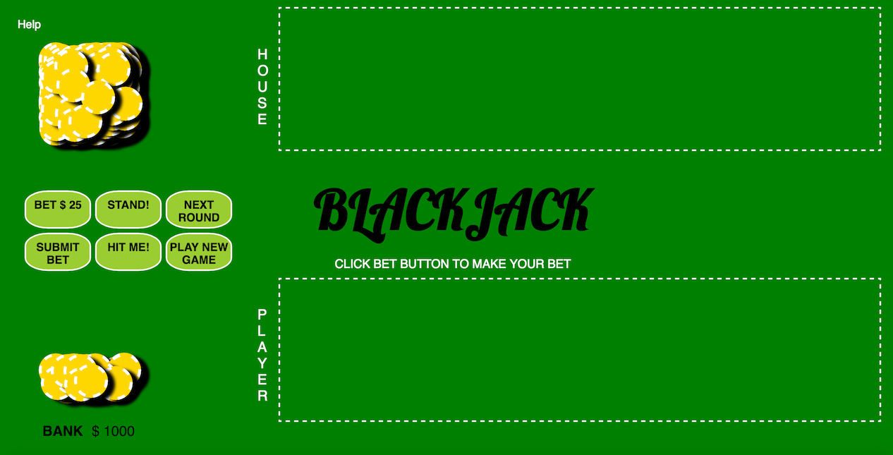

# BLACKJACK
Creator: Cyrus Shahrivar 
Version 1.40 (July 2016) 
http://www.cyrusshahrivar.com/blackjack

#### Table of Contents
1. [Technologies Used](#tech)
2. [Installation Instructions](#install)
3. [Initial Wireframes](#wireframes)
4. [User Stories](#userstories)
5. [Approach Taken](#approach)
6. [Unsolved Known Problems](#problems)
7. [Version History](#versions)

####  Technologies Used:
- HTML, CSS, Javascript, jQuery

#### Installation Instructions:
1. Use a modern browser.
2. Follow this link to the game: http://www.cyrusshahrivar.com/blackjack

#### Initial Wireframes:
- See wireframes folder:
  - https://github.com/cyrus-shahrivar/blackjack_app_GA/tree/master/wireframes

#### User Stories:
- Trello Page:
  - https://trello.com/b/hsLw8PtD/blackjack-app-ga
- Complete User Stories:
  - As a user, I want to be able to play blackjack.
  - As a user, I expect the game to look aesthetically pleasing.
  - As a user, I expect to at least play me against the computer dealer.
  - As a user, when I win I expect some type of reward effects since I'm not playing with real money.  That way I feel celebrated.
- In Progress User Stories
  - As a user, I expect there to be options in the game just like I would have in Vegas.

#### Approach Taken:
- First approach was to layout scenes on wireframe, put together html skeleton, basic css, and basic javascript.  I then looked at design websites to understand color theory a bit more to make my game look aesthetically pleasing.  I made iterative tweaks to the css and html as I built the game logic.
- This first approach used prompts to guide the game logic, however, I found that the user experiences were annoying, so I rebuilt the interface with buttons made from scratch.
- I had initially done prompts in my first approach to reduce complexity while I was building the game.  One lesson learned was working with event listeners upfront reduces total build time.  Another lesson learned was realizing that button based games follow a more function driven paradigm rather than a continuous object interactivity paradigm.  Also, thoroughly understanding the game win states and triggers before programming is a must.

#### Unsolved Known Problems:
- Hits exceeding allowed amount once winner or loser occurs in a round

#### Version History:
- Version 1.40: July 2016
  - Updated README file
- Version 1.35: June 2016
  - Updated README file
- Version 1.3: March 2016
  - Updated playing card look, updated some game logic
- Version 1.2: February 2016
  - Added help tooltip feature
- Version 1: October 2015
  - Initial release
